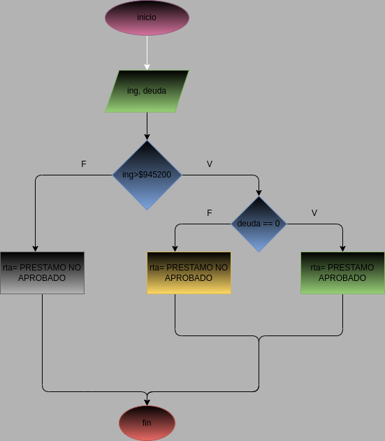

# taller_condicionales
# Ejercicio_2
Programa que permita realizar un préstamo bancario, teniendo en cuenta que el
préstamo será otorgado solamente a personas con ingresos superiores a $945200
y que no posea ninguna otra deuda.
# Diagrama de flujo
